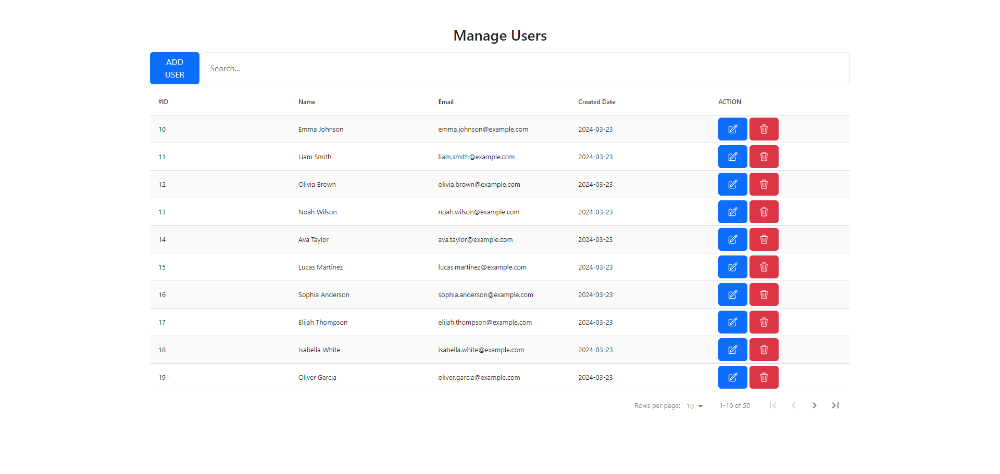

# PHP React CRUD Application

This is a  simple CRUD (Create, Read, Update, Delete) application built with PHP and React for managing users.

## Features

- Add a new user with name and email.
- View list of all users.
- Edit existing user details.
- Delete user.

## Usage

- View all users
- Add a new user: Fill out the form with the user's name and email, and click "Add User".
- Edit user: Click on the "Edit" button next to a user to edit their details.
- Delete user: Click on the "Delete" button next to a user to delete them from the system.

## License

This project is licensed under the [MIT License](LICENSE.md).
